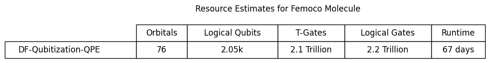

# Quantum Resource Estimation for FeMoco Molecule
**🔍** Research Project under Prof. Mathew Otten @ UW-Madison

## Overview
This research focuses on finding quantum resource estimates to determine the ground state energy of the FeMoco molecule using quantum algorithms. I used the Li[[2]](#references) FeMoco Hamiltonian, which consists of 76 orbitals and 113 electrons. I leveraged both Q# and Qualtran to build and test algorithms, utilizing the Q# estimator framework to find and compare resource estimates—such as `Logical Qubits`, `Logical T Gates`, `Total Logical Gates`, and `Runtime`—across three approaches: `First-Order Trotterized QPE`, `Double-Factorized (DF) Qubitized QPE`, and `Tensor-Hypercontraction (THC) Qubitized QPE`. The performance ranking emerged as ***THC > DF > Trotter***.

## Contents
1. - [**Resource Estimation Using Q#**](#resource-estimation-using-q)
    - [1.1 **Trotterized QPE Algorithm in Q#**](#trotterized-qpe-algorithm-in-q)
        - [1.1.1 Results](#results)
        - [1.1.2 Challenges](#challenges)
2. - [**Resource Estimation Using Qualtran**](#resource-estimation-using-qualtran)
    - [2.1 **Trotterized QPE**](#trotterized-qpe)
        - [2.1.1 Trotter Results](#trotter-results)
    - [2.2 **Double Factorized (DF) Qubitized QPE**](#double-factorized-df-qubitized-qpe)
        - [2.2.1 DF Results](#df-results)
    - [2.3 **Tensor-Hypercontraction (THC) Qubitized QPE**](#tensor-hypercontraction-thc-qubitized-qpe)
        - [2.3.1 THC Results](#thc-results)
3. - [**Comparison**](#comparison)
4. - [**Future Interests**](#future-interests)

---

## Resource Estimation Using Q#

### Trotterized QPE Algorithm in Q#

I began by implementing a first-order Trotterized Quantum Phase Estimation (QPE) algorithm using Q#, Microsoft's quantum programming language. This approach was tested on several small molecules to estimate their ground state energies, and I used Q#’s built-in resource estimator to determine key metrics like the number of logical qubits, logical T-gates, total logical gates, and runtime.

#### Results
Below are the ground state energy estimation results for He2 and Helium Hydrate molecule using first order trotterization algorithm in qh

## Helium Dimer (He2)
 

## Helium Hydrate (HeH)

 
#### Challenges
However, when I attempted to estimate resources for the FeMoco Hamiltonian with nearly 8 million pauli terms—the method ran into significant issues. Q# requires that the Hamiltonian be passed as a single large string from Python, and encoding/decoding such a massive string proved to be both computationally expensive and inefficient. Splitting the Hamiltonian into smaller chunks was also attempted, but this approach resulted in slow and inaccurate estimates
## Resource Estimation Using Qualtran

### Trotterized QPE
To address the challenges faced with Q#, I moved to using Qualtran, a Python-based resource estimation framework developed by Google. I reimplemented the first-order Trotterized QPE algorithm in Qualtran, estimating the FeMoco resources by considering just the first 50k Hamiltonian terms to keep the problem tractable.
#### Trotter Results
FeMoco molecule resource estimates
 

### Double Factorized (DF) Qubitized QPE
Next, By using existing double-factorized walk operator within the Qualtran framework built a quibitzed qpe version and estimated the resource of femoco molecule.    
#### DF Results
FeMoco molecule resource estimates
 

### Tensor-Hypercontraction (THC) Qubitized QPE
Finally, Qualtran have pre computed resource estimates for Li femoco hamiltonian. To compare with previous methods i applied a Tensor-Hypercontraction (THC) method in combination with qubitized QPE. 
#### THC Results
yet to post plots
## Comparison

| Algorithm                | Logical Qubits | Logical T-Gates | Total Logical Gates | Runtime  |
|--------------------------|---------------|----------------|----------------------|----------|
| **Trotterized QPE**      | 86            | 7.5 Trillion   | 7.9 Trillion         | 2 years  | 
| **DF Qubitized QPE**     | 2.05 k        | 2.1 Trillion   | 2.2 Trillion         | 67 days  | 
| **THC Qubitized QPE**    | --            | --             | --                   | --       | 

## Future Interests
✴️ Looking ahead, I'm interested in exploring Quantum Signal Processing (QSP) algorithms. Although QSP holds theoretical promise for even greater efficiency, its implementation poses significant challenges. Additionally, refining these methods for handling even larger Hamiltonians remains an important goal.

---

## Getting Started
### Clone Repo
### Install Dependecies
### Run Jupyter Notebooks for each section
---
## References

1. [QREChem: Quantum Resource Estimation Software for Chemistry Applications](https://arxiv.org/abs/2404.16351)  
2. Z. Li, J. Li, N. S. Dattani, C. J. Umrigar, and G. K.-L. Chan, *The Journal of Chemical Physics*, **150**, 024302 (2019).  
3. [Even More Efficient Quantum Computations of Chemistry Through Tensor Hypercontraction](https://arxiv.org/abs/2011.03494)  
4. [Qualtran: A Python-Based Resource Estimation Framework](https://github.com/quantumlib/Qualtran)  
5. [Q# (Microsoft Quantum Development Kit)](https://github.com/microsoft/qsharp)  
